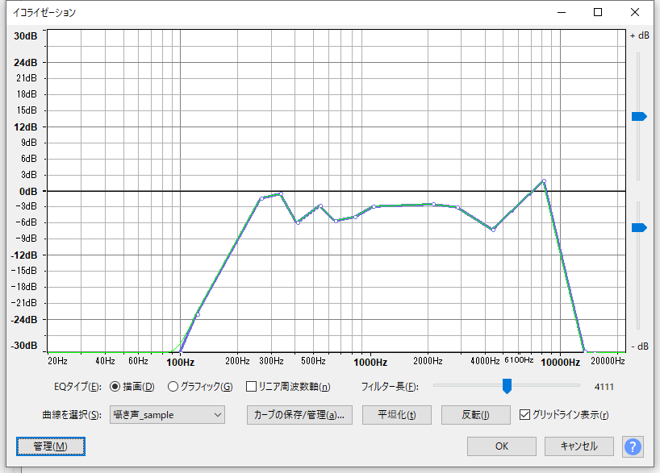
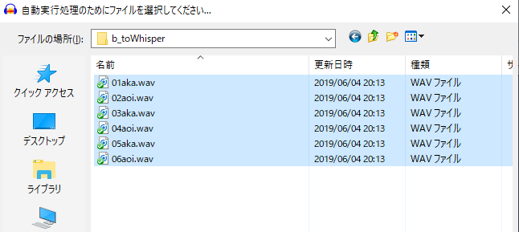

# 1. 概要
近年、ニコニコ動画にて、ボイロ音声を"囁き声"化したのボイロ劇が多く見られます。
多くの場合、ボイロ音声の"囁き声"化には、[音声をささやき声化するプログラム作ってみた](https://www.nicovideo.jp/watch/sm31882296)で紹介されているソフトを利用しているようです。

しかし、"囁き声"化ソフト(toWhisper)を使用した場合、イヤフォンを使用しないと視聴出ないぐらいのボリュームになります。
このようにボリュームを抑える理由は下記の2つがあると思っています。
1. 囁き声なので、演出的に小さい声にしている
2. ボリュームを大きくすると合成しているホワイトノイズ感が目立ってしまう

本記事では
- スピーカー視聴できる程度のボリュームで、2 のようにノイズ感を提言する加工する方法
- 複数の音声ファイルに対して、上記のノイズ低減処理を、一括で処理する方法を紹介します。
の2つを紹介します

筆者はこの手法を用いて、"囁き声"をスピーカー視聴レベルまで、ボリュームアップさせることができました。   
多少のノイズ感は残るものの、及第点レベルになっているかと思います。    
自分が作成した動画ですが、具体例として視聴してください(ダイマ）！  
ニコニコ動画 :  [【姉妹百合】真摯な甘いささやき【ピロートーク】](https://www.nicovideo.jp/watch/sm34020769)

## 2. 「ボリュームを大きくすると少し荒があるように聞こえる」ってどういうこと？ 
実際に音声を聞いてもらうとわかりやすいかと思います。  
それぞれをクリックすると sound cloud で視聴できます。

- [a. オリジナル音声](https://soundcloud.com/oota-yoshikazu/a-all)  
  琴葉姉妹のVoiceroidの出力のまま。

- [b. 囁き化ソフトで加工したのみ(オプションは "-l 0.14" のみ)](https://soundcloud.com/oota-yoshikazu/b-all) 
  変換後はオリジナル音声よりも音が小さくなっているので、ノイズ感は気にならない。
  しかし、イヤフォンを使わないと聞き取りが難しい動画になってしまう。

- [c. 囁き化ソフトで加工したボイスのボリュームアップ(13db)](https://soundcloud.com/oota-yoshikazu/c-all)  
   音質改良する前のボイス。少しノイズ感が気になる。

- [d. 音質改良化した cの音声(音質改良したボイス)](https://soundcloud.com/oota-yoshikazu/d-all)  
   イコライザーで調整。多少のノイズ感は残るが、スピーカー視聴できるレベルにボリュームアップできた。 

d はボリュームを上げても、ノイズ感が気にならない程度になったかと思います。  
また、b の囁き化ソフトの出力音声に対しても、同様の処理をすることで、音質改善が望めます(b のボリュームだとほぼ気になりませんが)。

**スクリプト**                        
茜(01aka.wav) : なぁ、葵。一緒に寝るの久しぶりやな。  
葵(02aoi.wav) : そうだねおねいちゃん。  
茜(03aka.wav) : ちょっと恥ずかしいんやけど、おねいちゃん葵としたいな。  
葵(04aoi.wav) : うん、恥ずかしいけどいいよ。  
茜(05aka.wav) : ええんか？  
葵(05aoi.wav) : いいけど、寝るまでしりとりするのは、子供っぽくて恥ずかしいよね。

## 3. 使用環境
- OS : Windows 10 (toWhisperNet v1.1が Windows用)
- 囁き声化ソフト : [toWhisper.Net版](https://github.com/ksasao/toWhisper)
- 音声加工ソフト : [Audacity](https://www.audacityteam.org/)

**補足**
今回は一括処理しやすいコマンド版の "toWhisper.Net版"を使いましたが、使いやすいGUI版もあります。

### toWhisper ソフト一覧
- オリジナル: zeta氏  [toWhisper](https://github.com/zeta-chicken/toWhisper) (Twitter : https://twitter.com/zeta0313)
- GUI版 : yamachu氏 [toWhisperGUI](https://github.com/yamachu/toWhisperGUI)
- .Net版 : [toWhisper .Net版](https://github.com/ksasao/toWhisper)


### お試しリポジトリ
お試ししやすいようにお試し用リポジトリを用意しました。
コマンドのパスやファイルパスなどは、こちらのリポジトリで作業することを前提に記述しています。

**本記事のお試しリポジトリ**
https://github.com/YoshikazuOota/howto_whisper

リポジトリに内包している[toWhisperNet v1.1](https://github.com/ksasao/toWhisper) は修正BSDライセンスの元、再配布をしております。  
著作権表記ファイル：howto_whisper/toWhisper-master/COPYRIGHT

## 4. 一つの音声に対してて音質改良化する
### 4.1 toWhisper.Netで声を"囁き化"する

オプションで下記２つを指定してコマンド実行します。

- -l lpf フィルター係数
- -o 出力先ファイル

```console
"./toWhisper-master/ToWhisperNet1.1/ToWhisperNet.exe" ./voices/a_original/01aka.wav -l 0.14 -o ./voices/b_toWhisper/01aka.wav
```

これで、```-o ``` で指定したファイルに"囁き声化"したファイルが出力されます。

**補足**
ここでは声質変換オプションを ```-l``` しか使いませんでしたが、下記のヘルプのようにいろいろ係数はあります。
いくつかの係数を試行錯誤する場合は、GUI版をおすすめします。

```console
The translating voice into whisper voice system
Version 0.91
Copyright (C) 2017 zeta

usage:
        toWhisperNet [options] [infile]
options:
        -o : output file name.       [N/A]     [wave file]
        -e : vowel sound file name.  [N/A]     [wave file]
        -l : lpf filter coefficient. [0.97]    [0.0, 1.0)
        -r : vowel sound rate.       [0.0]     [0.0, 1.0]
        -f : frame length(ms).       [20]
        -O : LPC order.              [auto]
        -h : print this sentence.
infile:
        wave file (MONO File only)
```

### 4.2 audacity で ボリュームアップ(13db)
次にaudacityを起動して、ボリュームアップします。  
ボリュームはスピーカー視聴できるレベルの音量として、13db 増幅させました。  
再生するとわかりますが、"囁き声"化する際の処理で、ホワイトノイズを合成しているためか、少しノイズ感があります。


### 4.3 イコライザーで音を整える。
ノイズ感を抑えるため、イコライザーでフィルターをかけて上げます。  
私の場合は下図のように調整しました。（これが正解というわけではありません。好みで調整してください）    
結果を聞いていただくと、ノイズ感が低減できているかと思います。

**ゲインの調整は下記サイトを参考にしました**  
http://goma1989.blog12.fc2.com/blog-entry-13.html




**補足**
このイコライザー設定ファイルはレポジトリの [whisper_eq_setting.XML](https://github.com/YoshikazuOota/howto_whisper/blob/master/whisper_eq_setting.XML)に、置いてあります。  
この設定を使いたい場合は「管理」ボタンから、先述の XML ファイルを読み込むとご利用できます。

### 4.3 セクションのまとめ
toWhisper で処理した音声を、ノイズ感を減らしつつスピーカー視聴できるレベルに、ボリュームアップできた。  
レポジトリに聴き比べ用の [audacity プロジェクトファイル](https://github.com/YoshikazuOota/howto_whisper/blob/master/audacity_sample/01aka.aup)も置いておきました。  


## 5. 4を一括処理する
上記手順で"囁き声"化はできますが、複数ファイルがある場合は少し面倒です。  
特に動画作りの作業は、ただでさえ煩雑なので、楽をしたいところです。  
そこで、自分なりの一括処理の仕方を紹介します。  

手順は下記の2ステップです。  
- (1) "囁き声"化はバッチ(.bat)で、一括変換する
- (2) (1)の出力をaudacityのチェーン処理を使って、一括変換する

### 5.1 (1)のバッチの作り方
バッチファイルを作って、4.1 のコマンドを登録します。  
一度作るまでが面倒ですが、声の再調整をしても簡単に"囁き声"化ができるので、後々とても楽になります。

**[サンプルバッチファイル](https://github.com/YoshikazuOota/howto_whisper/blob/master/whisper.bat)**

```whisper.bat
"./toWhisper-master/ToWhisperNet1.1/ToWhisperNet.exe" ./voices/a_original/01aka.wav -l 0.14 -o ./voices/b_toWhisper/01aka.wav
"./toWhisper-master/ToWhisperNet1.1/ToWhisperNet.exe" ./voices/a_original/02aoi.wav -l 0.14 -o ./voices/b_toWhisper/02aoi.wav
"./toWhisper-master/ToWhisperNet1.1/ToWhisperNet.exe" ./voices/a_original/03aka.wav -l 0.14 -o ./voices/b_toWhisper/03aka.wav
"./toWhisper-master/ToWhisperNet1.1/ToWhisperNet.exe" ./voices/a_original/04aoi.wav -l 0.14 -o ./voices/b_toWhisper/04aoi.wav
"./toWhisper-master/ToWhisperNet1.1/ToWhisperNet.exe" ./voices/a_original/05aka.wav -l 0.14 -o ./voices/b_toWhisper/05aka.wav
"./toWhisper-master/ToWhisperNet1.1/ToWhisperNet.exe" ./voices/a_original/06aoi.wav -l 0.14 -o ./voices/b_toWhisper/06aoi.wav
```

### 5.2 (2) audacity のチェーンを作る
チェーンと言うのは、audacity の一連の操作を登録して、一括で処理するものです。  
これも一度作ってしまえば、ファイルを指定するだけで上記 4.2, 4.3 の手順を行ってくれます。  
GUIの操作がメインになるため、操作画像を列挙します。

#### 5.2.a チェーンの編集を選ぶ


#### 5.2.b チェーン名を指定して新規作成


#### 5.2.c ボリュームアップ処理を追加(4.2と同じ)


#### 5.2.d イコライザー処理を追加(4.3と同じ)


#### 5.2.e ファイル出力処理を追加


**ここまでの追加処理(5.2.a～e)** ができると下図のようになります


### 5.3 5.2で作ったチェーンの使い方

#### 5.3.a チェーンの適用を選ぶ


#### 5.3.b 作ったチェーン名を指定


#### 5.3.c 適用するファイルを選択


#### 5.3.d 出力結果を確認する
5.3.c を行うと処理を行った音声ファイルのディレクトリに cleaned というディレクトリができ、そこに処理後のファイルが出力されます。


## 6 終わりに
囁き声って動画や音声作品的に、とても魅力的な演出だと思います。

しかし
- 使い方がわからない
- 一つ一つ処理するのが面倒

と言う方もいるかと思い記事にいたしました。
もし、皆様の作品づくりに役立てば幸いです。

解りにくいところなどございましたら、ご気軽にコメント下さい。  
また、『俺が考えた最強のイコライザー設定』などありましたら、ぜひ私にも教えてください！(真顔)

それでは、楽しい "囁き声" 変換ライフを！